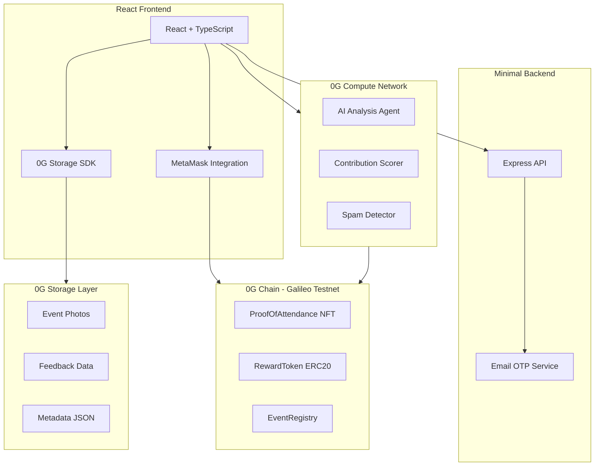
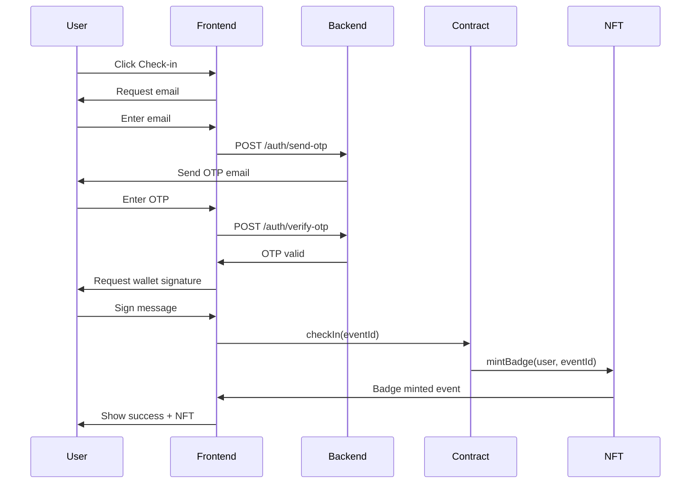

# 0G ProofPass - Implementation Plan

> Decentralized Event Attendance Verification Platform on 0G Network

## Architecture Overview



## Technology Stack

| Layer | Technology | Purpose |
|-------|------------|---------|
| Frontend | React 18 + TypeScript + Vite | User interface |
| Styling | TailwindCSS | Modern Web3 UI |
| Wallet | wagmi + ethers.js | MetaMask integration |
| Backend | Node.js + Express | Email OTP verification |
| Blockchain | 0G Chain (Galileo Testnet) | Smart contracts, NFTs, tokens |
| Storage | 0G Storage SDK | Immutable photo/feedback storage |
| AI | 0G Compute Network | Contribution analysis |

## Project Structure

```
0g-proof/
├── frontend/                    # React + TypeScript app
│   ├── src/
│   │   ├── components/          # Reusable UI components
│   │   │   ├── ui/              # Base UI components
│   │   │   ├── wallet/          # Wallet connection components
│   │   │   ├── event/           # Event-related components
│   │   │   └── nft/             # NFT display components
│   │   ├── pages/               # Route pages
│   │   │   ├── Home.tsx         # Landing & event discovery
│   │   │   ├── Event.tsx        # Event check-in page
│   │   │   ├── Contribute.tsx   # Photo/feedback submission
│   │   │   ├── Profile.tsx      # User public profile
│   │   │   └── Dashboard.tsx    # Organizer dashboard
│   │   ├── hooks/               # Custom React hooks
│   │   │   ├── useWallet.ts     # Wallet connection
│   │   │   ├── useContract.ts   # Contract interactions
│   │   │   └── useStorage.ts    # 0G Storage operations
│   │   ├── services/            # External service integrations
│   │   │   ├── storage.ts       # 0G Storage SDK wrapper
│   │   │   ├── compute.ts       # 0G Compute AI integration
│   │   │   └── api.ts           # Backend API client
│   │   ├── contracts/           # Contract ABIs and addresses
│   │   │   ├── abis/            # Generated ABIs
│   │   │   └── addresses.ts     # Deployed contract addresses
│   │   ├── utils/               # Helper functions
│   │   ├── types/               # TypeScript type definitions
│   │   └── config/              # App configuration
│   ├── public/                  # Static assets
│   ├── index.html
│   ├── package.json
│   ├── tailwind.config.js
│   ├── tsconfig.json
│   └── vite.config.ts
├── backend/                     # Minimal Express server
│   ├── src/
│   │   ├── routes/
│   │   │   └── auth.ts          # Email OTP endpoints
│   │   ├── services/
│   │   │   └── email.ts         # Nodemailer service
│   │   ├── middleware/
│   │   │   └── cors.ts          # CORS configuration
│   │   └── index.ts             # Server entry point
│   ├── package.json
│   └── tsconfig.json
├── contracts/                   # Solidity smart contracts
│   ├── src/
│   │   ├── EventRegistry.sol    # Event management
│   │   ├── ProofOfAttendanceNFT.sol  # ERC721 badges
│   │   └── RewardToken.sol      # ERC20 rewards
│   ├── test/                    # Contract tests
│   ├── script/                  # Deployment scripts
│   ├── foundry.toml
│   └── package.json
├── docs/                        # Documentation
│   └── plan.md                  # This file
├── .env.example                 # Environment template
├── .gitignore
└── README.md
```

## 0G Network Configuration

```typescript
// 0G Galileo Testnet Configuration
export const OG_CHAIN_CONFIG = {
  id: 16600,
  name: '0G Galileo Testnet',
  network: 'og-galileo',
  nativeCurrency: {
    name: '0G',
    symbol: 'OG',
    decimals: 18,
  },
  rpcUrls: {
    default: { http: ['https://evmrpc-testnet.0g.ai'] },
    public: { http: ['https://evmrpc-testnet.0g.ai'] },
  },
  blockExplorers: {
    default: { 
      name: 'Chain Scan', 
      url: 'https://chainscan-galileo.0g.ai' 
    },
  },
};

// 0G Storage Configuration
export const OG_STORAGE_CONFIG = {
  indexerRpc: 'https://indexer-storage-testnet-standard.0g.ai',
  evmRpc: 'https://evmrpc-testnet.0g.ai',
  flowContract: '0x...',  // Flow contract address
};
```

## Resources

- **0G Documentation**: https://docs.0g.ai/
- **Builder Hub**: https://build.0g.ai/
- **Storage Scan**: https://storagescan-galileo.0g.ai/
- **Chain Scan**: https://chainscan-galileo.0g.ai/
- **Faucet**: https://faucet.0g.ai/

---

## Implementation Phases

### Phase 1: Project Foundation

#### Step 1.1: Initialize Frontend

Create Vite + React + TypeScript project with modern tooling.

**Dependencies:**
```json
{
  "dependencies": {
    "react": "^18.2.0",
    "react-dom": "^18.2.0",
    "react-router-dom": "^6.20.0",
    "wagmi": "^2.0.0",
    "viem": "^2.0.0",
    "@tanstack/react-query": "^5.0.0",
    "@0glabs/0g-ts-sdk": "latest",
    "ethers": "^6.9.0",
    "lucide-react": "^0.294.0"
  },
  "devDependencies": {
    "typescript": "^5.3.0",
    "tailwindcss": "^3.3.0",
    "autoprefixer": "^10.4.0",
    "postcss": "^8.4.0",
    "vite": "^5.0.0",
    "@types/react": "^18.2.0"
  }
}
```

**Tasks:**
- [ ] Initialize Vite project: `npm create vite@latest frontend -- --template react-ts`
- [ ] Install and configure TailwindCSS
- [ ] Set up React Router with page structure
- [ ] Create base component library
- [ ] Configure environment variables

#### Step 1.2: Initialize Backend

Minimal Express server for email OTP only.

**Dependencies:**
```json
{
  "dependencies": {
    "express": "^4.18.0",
    "cors": "^2.8.0",
    "nodemailer": "^6.9.0",
    "dotenv": "^16.3.0"
  },
  "devDependencies": {
    "typescript": "^5.3.0",
    "tsx": "^4.0.0",
    "@types/express": "^4.17.0",
    "@types/cors": "^2.8.0",
    "@types/nodemailer": "^6.4.0"
  }
}
```

**Tasks:**
- [ ] Initialize Node.js project with TypeScript
- [ ] Create Express server with CORS
- [ ] Implement email OTP generation and verification
- [ ] Add rate limiting for security

#### Step 1.3: Configure 0G Network

Set up connections to 0G Galileo testnet.

**Tasks:**
- [ ] Add 0G chain to wagmi configuration
- [ ] Install `@0glabs/0g-ts-sdk`
- [ ] Create storage service wrapper
- [ ] Get testnet tokens from faucet

---

### Phase 2: Smart Contract Development

#### Step 2.1: EventRegistry Contract

Manages events and check-ins.

```solidity
// contracts/src/EventRegistry.sol
contract EventRegistry {
    struct Event {
        uint256 id;
        string name;
        string location;
        uint256 startTime;
        uint256 endTime;
        address organizer;
        bool active;
    }

    struct CheckIn {
        address attendee;
        uint256 eventId;
        uint256 timestamp;
        bool verified;
    }

    mapping(uint256 => Event) public events;
    mapping(bytes32 => CheckIn) public checkIns; // hash(eventId, wallet)
    
    event EventCreated(uint256 indexed eventId, string name, address organizer);
    event AttendeeCheckedIn(uint256 indexed eventId, address indexed attendee);
    
    function createEvent(...) external returns (uint256);
    function checkIn(uint256 eventId) external;
    function isCheckedIn(uint256 eventId, address attendee) external view returns (bool);
}
```

#### Step 2.2: ProofOfAttendanceNFT Contract

Dynamic NFT badges with upgradeable tiers.

```solidity
// contracts/src/ProofOfAttendanceNFT.sol
contract ProofOfAttendanceNFT is ERC721, ERC721URIStorage {
    enum Tier { Attendee, Contributor, Champion }
    
    struct Badge {
        uint256 eventId;
        string eventName;
        string eventDate;
        string location;
        Tier tier;
        uint256 contributionScore;
        string storageHash; // 0G Storage reference
    }
    
    mapping(uint256 => Badge) public badges;
    mapping(bytes32 => uint256) public eventAttendeeToToken; // hash(eventId, wallet)
    
    event BadgeMinted(uint256 indexed tokenId, address indexed owner, uint256 eventId);
    event BadgeUpgraded(uint256 indexed tokenId, Tier newTier, uint256 newScore);
    
    function mintBadge(address to, uint256 eventId, ...) external returns (uint256);
    function upgradeBadge(uint256 tokenId, Tier tier, uint256 score) external;
    function tokenURI(uint256 tokenId) public view override returns (string memory);
}
```

#### Step 2.3: RewardToken Contract

ERC20 token for tier-based rewards.

```solidity
// contracts/src/RewardToken.sol
contract RewardToken is ERC20 {
    mapping(address => mapping(uint256 => bool)) public claimed; // wallet => eventId => claimed
    
    uint256 public constant ATTENDEE_REWARD = 10 * 10**18;
    uint256 public constant CONTRIBUTOR_REWARD = 50 * 10**18;
    uint256 public constant CHAMPION_REWARD = 100 * 10**18;
    
    event RewardClaimed(address indexed user, uint256 indexed eventId, uint256 amount);
    
    function claimReward(uint256 eventId, uint8 tier) external;
    function getRewardAmount(uint8 tier) public pure returns (uint256);
}
```

#### Step 2.4: Deploy Contracts

**Tasks:**
- [ ] Set up Foundry or Hardhat
- [ ] Write deployment scripts
- [ ] Deploy to 0G Galileo testnet
- [ ] Verify on Chain Scan
- [ ] Export ABIs to frontend

---

### Phase 3: Core Frontend Features

#### Step 3.1: Wallet Connection

MetaMask integration using wagmi.

```typescript
// frontend/src/hooks/useWallet.ts
export function useWallet() {
  const { address, isConnected } = useAccount();
  const { connect } = useConnect();
  const { disconnect } = useDisconnect();
  const { switchChain } = useSwitchChain();
  
  const connectWallet = async () => {
    await connect({ connector: injected() });
    await switchChain({ chainId: OG_CHAIN_CONFIG.id });
  };
  
  return { address, isConnected, connectWallet, disconnect };
}
```

**Tasks:**
- [ ] Create WalletProvider with wagmi
- [ ] Build ConnectWallet component
- [ ] Add network switching logic
- [ ] Display wallet info in header

#### Step 3.2: Event Discovery Page

List available events with check-in status.

**Components:**
- `EventCard` - Display event info and status
- `EventList` - Grid of available events
- `EventFilters` - Filter by status, date

**Tasks:**
- [ ] Create event listing UI
- [ ] Fetch events from EventRegistry contract
- [ ] Show check-in status per wallet
- [ ] Add search and filtering

#### Step 3.3: Event Check-in Flow

Multi-step verification process.



**Tasks:**
- [ ] Build check-in modal with steps
- [ ] Integrate email OTP verification
- [ ] Add wallet signature for proof
- [ ] Call smart contract check-in
- [ ] Display minted NFT badge

---

### Phase 4: 0G Storage Integration

#### Step 4.1: Storage Service

Wrapper for 0G Storage SDK.

```typescript
// frontend/src/services/storage.ts
import { ZgFile, Indexer, getFlowContract } from '@0glabs/0g-ts-sdk';

export class StorageService {
  private indexer: Indexer;
  private flowContract: any;
  
  async initialize(signer: Signer) {
    this.indexer = new Indexer(OG_STORAGE_CONFIG.indexerRpc);
    this.flowContract = getFlowContract(OG_STORAGE_CONFIG.flowContract, signer);
  }
  
  async uploadFile(file: File, metadata: object): Promise<string> {
    const zgFile = await ZgFile.fromBlob(file);
    const [tree, treeErr] = await zgFile.merkleTree();
    if (treeErr) throw treeErr;
    
    const rootHash = tree.rootHash();
    await this.flowContract.submit(/* ... */);
    await this.indexer.upload(zgFile);
    
    return rootHash;
  }
  
  async uploadJSON(data: object): Promise<string> {
    const blob = new Blob([JSON.stringify(data)], { type: 'application/json' });
    return this.uploadFile(blob as File, {});
  }
  
  async downloadFile(rootHash: string): Promise<Blob> {
    return await this.indexer.download(rootHash);
  }
}
```

#### Step 4.2: Photo Upload Component

Upload event photos to 0G Storage.

**Data Structure:**
```typescript
interface PhotoSubmission {
  eventId: number;
  walletAddress: string;
  timestamp: number;
  imageHash: string;      // 0G Storage root hash
  thumbnailHash: string;  // Optional thumbnail
}
```

**Tasks:**
- [ ] Create photo upload UI with preview
- [ ] Implement file upload to 0G Storage
- [ ] Store submission metadata
- [ ] Add progress indicator

#### Step 4.3: Feedback Submission

Store written feedback immutably.

**Data Structure:**
```typescript
interface FeedbackSubmission {
  eventId: number;
  walletAddress: string;
  timestamp: number;
  feedbackText: string;
  rating: number;         // 1-5 stars
  contentHash: string;    // Hash of feedback for verification
}
```

**Tasks:**
- [ ] Create feedback form UI
- [ ] Upload feedback JSON to 0G Storage
- [ ] Link to photo submissions
- [ ] Show submission confirmation

---

### Phase 5: AI Contribution Analysis

#### Step 5.1: 0G Compute Integration

Connect to 0G Compute Network for AI inference.

```typescript
// frontend/src/services/compute.ts
export class AIAnalysisService {
  async analyzeContribution(
    photos: string[],      // Storage hashes
    feedback: string
  ): Promise<ContributionAnalysis> {
    // Connect to 0G Compute Network
    // Submit analysis request
    // Return scored result
  }
}

interface ContributionAnalysis {
  photoScore: number;      // 0-100
  feedbackScore: number;   // 0-100
  overallScore: number;    // 0-100
  tier: 'Attendee' | 'Contributor' | 'Champion';
  reasoning: string;
  isSpam: boolean;
  isDuplicate: boolean;
}
```

#### Step 5.2: Scoring Algorithm

Tier classification based on AI analysis.

| Tier | Score Range | Criteria |
|------|-------------|----------|
| Attendee | 0-33 | Basic check-in, minimal/no contributions |
| Contributor | 34-66 | Quality photos, helpful feedback |
| Champion | 67-100 | Exceptional photos, detailed insights, engagement |

**Scoring Factors:**
- Photo quality and relevance (40%)
- Feedback depth and helpfulness (40%)
- Spam/duplicate detection (-penalty)
- Engagement metrics (20%)

#### Step 5.3: Spam Detection

Prevent abuse and duplicate submissions.

**Detection Methods:**
- Image hash comparison for duplicates
- AI content analysis for spam text
- Rate limiting per wallet
- Similarity scoring for near-duplicates

**Tasks:**
- [ ] Integrate 0G Compute SDK
- [ ] Create analysis request handler
- [ ] Implement scoring logic
- [ ] Add spam detection layer
- [ ] Cache results to avoid re-analysis

---

### Phase 6: Reward System

#### Step 6.1: NFT Badge Upgrades

Update badge metadata after AI scoring.

```typescript
async function upgradeBadge(tokenId: number, analysis: ContributionAnalysis) {
  const tierEnum = getTierEnum(analysis.tier);
  const tx = await nftContract.upgradeBadge(
    tokenId,
    tierEnum,
    analysis.overallScore
  );
  await tx.wait();
}
```

**Visual Tiers:**
- Attendee: Bronze badge
- Contributor: Silver badge  
- Champion: Gold badge with glow effect

#### Step 6.2: Token Claim Interface

Claim rewards based on contribution tier.

| Tier | Reward Amount |
|------|---------------|
| Attendee | 10 OG tokens |
| Contributor | 50 OG tokens |
| Champion | 100 OG tokens |

**Tasks:**
- [ ] Create claim rewards UI
- [ ] Check eligibility (NFT ownership + tier)
- [ ] Execute claim transaction
- [ ] Show transaction confirmation
- [ ] Update displayed balance

---

### Phase 7: Profile and Dashboard

#### Step 7.1: Public Profile Page

Display user's attendance history and achievements.

**URL:** `/profile/:walletAddress`

**Sections:**
1. **Header** - Avatar, wallet address, total stats
2. **Events Attended** - List with dates and tiers
3. **NFT Gallery** - Badge collection with metadata
4. **Contribution History** - Scores over time
5. **Rewards Summary** - Total claimed tokens

**Tasks:**
- [ ] Create profile layout
- [ ] Fetch NFTs owned by address
- [ ] Display event attendance history
- [ ] Show contribution score chart
- [ ] Calculate and display totals

#### Step 7.2: Organizer Dashboard

Event management and analytics for hosts.

**URL:** `/dashboard` (requires organizer wallet)

**Sections:**
1. **Event Overview** - Active events with stats
2. **Attendee List** - Verified check-ins with export
3. **Feedback Panel** - AI-filtered submissions
4. **Leaderboard** - Top contributors ranked
5. **Analytics** - Charts and metrics

**Analytics Metrics:**
- Total attendees vs check-ins
- Tier distribution pie chart
- Average contribution score
- Photo/feedback submission rate
- Reward claims percentage

**Tasks:**
- [ ] Create dashboard layout
- [ ] Add organizer authentication
- [ ] Build attendee data table
- [ ] Implement feedback filtering
- [ ] Create analytics visualizations

---

### Phase 8: UI Polish and Demo

#### Step 8.1: Design System

Modern Web3 aesthetic optimized for hackathon.

**Color Palette:**
```css
:root {
  --bg-primary: #0a0b0f;
  --bg-secondary: #12141a;
  --bg-card: #1a1d25;
  --accent-primary: #8b5cf6;    /* Purple */
  --accent-secondary: #06b6d4;  /* Cyan */
  --text-primary: #f8fafc;
  --text-secondary: #94a3b8;
  --border: #2a2d35;
  --success: #22c55e;
  --error: #ef4444;
}
```

**Typography:**
- Headings: Space Grotesk or Outfit
- Body: Inter or DM Sans
- Mono: JetBrains Mono

**Components:**
- Glassmorphism cards
- Gradient borders and buttons
- Animated badge displays
- Skeleton loading states
- Toast notifications

#### Step 8.2: Animations

Micro-interactions and page transitions.

**Key Animations:**
- Wallet connection pulse
- NFT badge reveal animation
- Score counter animation
- Tier upgrade celebration
- Page transition fades

#### Step 8.3: Demo Features

Optimize for hackathon presentation.

**Tasks:**
- [ ] Add demo mode toggle
- [ ] Pre-populate test events
- [ ] Create sample user profiles
- [ ] Add guided tour/onboarding
- [ ] Ensure mobile responsiveness

---

## Implementation Checklist

### Phase 1: Foundation
- [ ] 1.1 Initialize Vite + React + TypeScript frontend
- [ ] 1.2 Set up TailwindCSS and base components
- [ ] 1.3 Initialize Express backend for OTP
- [ ] 1.4 Configure 0G network settings
- [ ] 1.5 Install and test 0G SDK

### Phase 2: Smart Contracts
- [ ] 2.1 Write EventRegistry contract
- [ ] 2.2 Write ProofOfAttendanceNFT contract
- [ ] 2.3 Write RewardToken contract
- [ ] 2.4 Deploy to Galileo testnet
- [ ] 2.5 Verify and export ABIs

### Phase 3: Core Features
- [ ] 3.1 Implement wallet connection
- [ ] 3.2 Build event discovery page
- [ ] 3.3 Create check-in flow with OTP
- [ ] 3.4 Integrate NFT minting

### Phase 4: Storage
- [ ] 4.1 Create 0G Storage service
- [ ] 4.2 Build photo upload component
- [ ] 4.3 Implement feedback submission
- [ ] 4.4 Add data retrieval

### Phase 5: AI Analysis
- [ ] 5.1 Integrate 0G Compute
- [ ] 5.2 Implement scoring algorithm
- [ ] 5.3 Add spam detection
- [ ] 5.4 Connect to badge upgrades

### Phase 6: Rewards
- [ ] 6.1 Implement badge upgrades
- [ ] 6.2 Build claim interface
- [ ] 6.3 Add transaction handling

### Phase 7: Pages
- [ ] 7.1 Create public profile page
- [ ] 7.2 Build organizer dashboard
- [ ] 7.3 Add analytics charts

### Phase 8: Polish
- [ ] 8.1 Apply design system
- [ ] 8.2 Add animations
- [ ] 8.3 Create demo mode
- [ ] 8.4 Test and optimize

---

## Estimated Timeline

| Phase | Duration | Dependencies |
|-------|----------|--------------|
| Phase 1 | 1 day | None |
| Phase 2 | 1-2 days | Phase 1 |
| Phase 3 | 2 days | Phase 1, 2 |
| Phase 4 | 1-2 days | Phase 1 |
| Phase 5 | 2 days | Phase 4 |
| Phase 6 | 1 day | Phase 2, 5 |
| Phase 7 | 2 days | Phase 3-6 |
| Phase 8 | 1-2 days | Phase 7 |

**Total: 10-14 days for full implementation**

---

## Environment Variables

```env
# Frontend (.env)
VITE_OG_CHAIN_ID=16600
VITE_OG_RPC_URL=https://evmrpc-testnet.0g.ai
VITE_OG_STORAGE_INDEXER=https://indexer-storage-testnet-standard.0g.ai
VITE_EVENT_REGISTRY_ADDRESS=0x...
VITE_NFT_CONTRACT_ADDRESS=0x...
VITE_REWARD_TOKEN_ADDRESS=0x...
VITE_BACKEND_URL=http://localhost:3001

# Backend (.env)
PORT=3001
SMTP_HOST=smtp.gmail.com
SMTP_PORT=587
SMTP_USER=your-email@gmail.com
SMTP_PASS=your-app-password
OTP_EXPIRY_MINUTES=10
```

---

## Next Steps

1. **Approve this plan** to begin implementation
2. Start with **Phase 1** - Project Foundation
3. Obtain **0G testnet tokens** from faucet
4. Follow phases sequentially, testing each before moving on

Ready to begin implementation when you approve!

